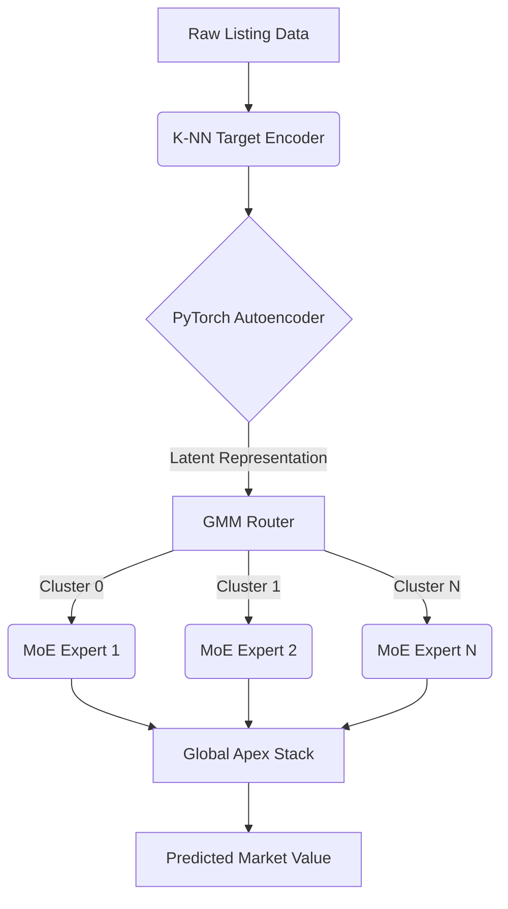

# Arbitrage Engine Architecture

## 1. System Overview
The Arbitrage Engine is a high-performance, asynchronous pipeline designed to ingest unstructured laptop listings, normalize their hardware topologies, and compute true market valuations using a PyTorch-backed Mixture of Experts (MoE) architecture.

## 2. Feature Imputation & Vectorization
The pipeline bypasses fragile regex for unseen hardware variants by utilizing a **K-Nearest Neighbors (K-NN) TF-IDF Text Encoder**. 
- **Character N-Grams:** Hardware strings are vectorized using TF-IDF (max 1000 features).
- **Cosine Similarity:** If a hardware configuration is unseen, the system computes the nearest known neighbor.
- **Fallback Threshold:** If similarity < `0.45`, the pipeline safely degrades to the target's global median, preventing NaN explosions during matrix multiplication.

## 3. The Inference Stack
The prediction engine (`arbitrage_engine.py`) operates in a dual-stage neural topology:
1. **Dimensionality Reduction (Autoencoder):** High-dimensional categorical and numeric features are scaled and compressed into a dense latent space.
2. **Dynamic Routing (GMM):** A Gaussian Mixture Model reads the latent state and assigns the listing to a specialized expert model.
3. **MoE Ensemble:** The routed expert's prediction is blended with a `Global_Apex_Stack` model to ensure boundary constraint smoothing.

## 4. Execution & Thread Safety
The prediction function is wrapped in thread-safe singleton locks (`_MODEL_LOCK`), allowing concurrent invocation from the GUI (`pipeline_gui.py`) or background polling workers without duplicating the 1.3GB memory footprint of the `.joblib`/`.pth` weights.
