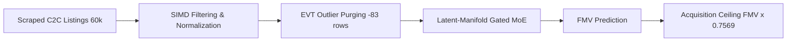

# Laptop Arbitrage Engine

Automated valuation and arbitrage detection for second-hand INR laptops. Decouples Fair Market Value (FMV) from safe acquisition ceilings to protect capital against overvalued inventory and fraudulent listings.

- **Risk Reduction**: Achieves a **57.54% reduction in financial downside risk** via asymmetric pinball loss optimization ($10\times$ overvaluation penalty).
- **Safety Cushion**: Locks an acquisition ceiling of `FMV × 0.7569` (a built-in **24.31% gross margin cushion**).
- **Out-of-Sample Accuracy**: Symmetric $R^2 = 0.7695$ (log-space $R^2 = 0.8231$, MAE = ₹7,023.77) across **1,939 blind holdout records** ($25\%$ out-of-sample test split of the 7,801 cleaned dataset).



## Quick Start

### 1. Install & Resolve LFS Weights
```bash
git lfs pull
pip install pandas numpy scipy scikit-learn torch pyarrow joblib matplotlib seaborn
```

### 2. Run CLI Arbitrage Inference
```bash
cd src
python master_predictor.py --margin 5.0 --price-min 20000
```

### 3. Programmatic Usage & Sample Deal
```python
import pandas as pd
from src.arbitrage_engine import predict

# Pass structured fields matching Kaggle_Master_Engineered_State.csv schema
listing = pd.DataFrame([{
    "clean_brand": "HP",
    "clean_model_series": "HP EliteBook",
    "cpu_composite_clean": "INTEL_CORE_I5_SKU11_TH",
    "clean_gpu_composite": "INTEL_UHD_SYSRAM",
    "gpu_vendor": "INTEL",
    "ram_size_gb": 8,
    "storage_size_gb": 256,
    "clean_display_inches": 14.0,
    "cpu_tier": 3,
    "gpu_tier": 1,
    "is_discrete": 0,
    "state": "Gujarat",
    "city": "Ahmedabad",
    "price": 29500.0
}])

result_df = predict(input_df=listing)
# Real Telemetry Output (Row 0 benchmark):
# Fair Market Value (FMV): ₹39,785.11
# Safe Acquisition Ceiling (FMV × 0.7569): ₹30,113.35
# Asking Price: ₹29,500.00 -> Net Arbitrage Spread: +₹10,285.11 (BUY SIGNAL)
```

## Marketplace Unit Economics

Standard models optimize for symmetric accuracy ($R^2$, MSE), treating a +₹5,000 error identically to a -₹5,000 error. In recommerce:
- **Overvaluation (+₹5,000)**: Direct financial loss and trapped working capital.
- **Undervaluation (-₹5,000)**: Passed trade (zero financial loss).

Our pipeline applies Nelder-Mead simplex optimization against an asymmetric pinball loss ($\mathcal{L}_{\text{asym}}$) penalizing overvaluation at $10:1$ over undervaluation.

| Metric | Baseline | Calibrated Engine | Improvement |
| :--- | :---: | :---: | :---: |
| **Downside Risk Score** | 34,725.2 | **14,744.8** | **-57.54%** |
| **Purchasing Margin Cushion** | 0.00% | **24.31%** (`0.7569`) | Safe Bid Ceiling |
| **Holdout $R^2$ (Linear / Log)** | — | **0.7695 / 0.8231** | 1,939 holdout rows |

## Verified Data Cleaning Funnel

Raw scraped C2C listings undergo strict domain cleaning before neural training (empirical telemetry trace):

| Stage | Records | Retained | Primary Action |
| :--- | :---: | :---: | :--- |
| **1. Raw Scraped Ingestion** | 60,471 | 100.0% | Multi-source C2C listings |
| **2. Spam & Missing Specs** | 24,343 | 40.3% | Deduped keyword stuffing & dropped rows missing CPU/RAM/SSD |
| **3. CPU Taxonomy Filtering** | 9,980 | 16.5% | Removed unclassified CPU labels |
| **4. Desktop Chassis Filtering** | 9,923 | 16.4% | Removed desktop chassis bundles |
| **5. Hardware Bounds (SSD & Display)** | 7,884 | 13.0% | Enforced SSD-only & physical display diagonals (10"–18.5") |
| **6. EVT Tail Anomaly Purging** | **7,801** | **12.9%** | Removed **83 mispriced tail exceedances** ($1.05\%$, Generalized Pareto threshold $u=0.4571$) |

## Architecture & SLAs

- **Model Architecture**: PyTorch Autoencoder + Gaussian Mixture Model (GMM) routing to a Latent-Manifold Gated Stacking Ensemble (LMGSE).
- **OOV & Fallback Resilience**: Hierarchical topological fallback and hardware-signature hash-dictionary lookup handle unseen categorical values.
- **Model Footprint**: `~2.4 GB` pre-trained weights (`models/`) managed via Git LFS.
- **Memory & Safety**: Requires `4 GB+ RAM`. Singleton weights load behind double-checked thread locks (`_MODEL_LOCK`).
- **Complete Technical Specification**: See [`ARCHITECTURE.md`](ARCHITECTURE.md) for deep neural routing and GMM topology specs.

## License & Commercial Compliance

Dual-licensed for open-source collaboration and enterprise integration:
- **Open-Source (AGPL-3.0)**: Free for research and individual use. Network deployments (SaaS/REST APIs) trigger Section 13 **Corresponding Source** disclosure.
- **Commercial Exemption**: Proprietary SaaS or enterprise integration without AGPL-3.0 copyleft disclosure requires a Commercial License ([Contact Maintainers](https://github.com/pagar-ani/laptop-arbitrage-engine/issues)).
